# Задача 1
### Формулировка задачи
Вывести служебную информацию о пакете matplotlib (Python). Разобрать основные элементы содержимого файла со служебной информацией из пакета.
### Решение
```
pip show matplotlib
```


#### Основные элементы содержимого файла со служебной информацией из пакета:
* Name: matplotlib (имя пакета)
* Version: 3.9.2 (версия пакета по стандарту семантического версионирования (SemVer). В данном случае 3.9.2 указывает на третью основную версию (MAJOR — 3), с девятым минорным обновлением (MINOR — 9), а патч (PATCH — 2) включает исправления ошибок без изменения функциональности)
* Summary: Python plotting package (краткое описание пакета. В этом случае пакет matplotlib — это библиотека для построения графиков в Python)
* Home-page: https://matplotlib.org (ссылка на официальный сайт или документацию пакета)
* Author: John D. Hunter, Michael Droettboom (авторы пакета)
* Author-email: Unknown matplotlib-users@python.org (контактная информация автора)
* License: License agreement for matplotlib versions 1.3.0 and later (лицензия, по которой распространяется пакет)
### Формулировка задачи
Как получить пакет без менеджера пакетов, прямо из репозитория?
### Решение
Чтобы скачать и установить пакет без использования менеджера пакетов, можно получить его исходный код напрямую из репозитория, например, с GitHub.
```
git clone https://github.com/matplotlib/matplotlib.git
cd matplotlib
pip install .
```


# Задача 2
### Формулировка задачи
Вывести служебную информацию о пакете express (JavaScript). Разобрать основные элементы содержимого файла со служебной информацией из пакета. Как получить пакет без менеджера пакетов, прямо из репозитория?
### Решение
```
npm view express
```


#### Основные элементы содержимого файла со служебной информацией из пакета:
* express (имя пакета)
* 4.21.0 (Версия пакета по стандарту семантического версионирования (SemVer). В данном случае 4.21.0 указывает на четвёртую основную версию (MAJOR — 4), с двадцать первым минорным обновлением (MINOR — 9), а патч (PATCH — 0) включает исправления ошибок без изменения функциональности)
* MIT (лицензия, по которой распространяется пакет (в данном случае MIT, одна из самых открытых лицензий)
* deps: 31 (количество зависимостей. Пакет Express требует 31 внешнюю библиотеку для работы)
* versions: 279 (количество опубликованных версий Express.js)
* Fast, unopinionated, minimalist web framework (краткое описание пакета: Express — это быстрый, минималистичный веб-фреймворк для Node.js)
* http://expressjs.com/ (ссылка на официальный сайт, где можно найти документацию и другие ресурсы, связанные с пакетом)
* keywords: express, framework, sinatra, web, http, rest, restful, router, app, api (список ключевых слов, по которым можно найти пакет)
* dist (информация о дистрибуции пакета)
  * .tarball: https://registry.npmjs.org/express/-/express-4.21.0.tgz (ссылка на архив пакета в формате .tgz, который можно скачать)
  * .shasum: d57cb706d49623d4ac27833f1cbc466b668eb915 (контрольная сумма (SHA-1) для проверки целостности пакета)
  * .integrity: sha512-VqcNGcj/Id5ZT1LZ/cfihi3ttTn+NJmkli2eZADigjq29qTlWi/hAQ43t/VLPq8+UX06FCEx3ByOYet6ZFblng== (контрольная сумма по алгоритму SHA-512 для подтверждения целостности)
  * .unpackedSize: 220.8 kB (размер распакованного пакета)
* dependencies (список зависимостей пакета и их версии)
* maintainers (список мейнтейнеров пакета и их контактные данные)
* dist-tags (теги дистрибуции)
  * latest: 4.21.0 (стабильная версия пакета)
  * next: 5.0.0 (следующая версия, которая еще не является стабильной)
### Формулировка задачи
Как получить пакет без менеджера пакетов, прямо из репозитория?
### Решение
Чтобы скачать и установить пакет без использования менеджера пакетов, можно получить его исходный код напрямую из репозитория, например, с GitHub.
```
git clone https://github.com/expressjs/express.git
cd express
npm install
```


# Задача 3
### Формулировка задачи
Сформировать graphviz-код и получить изображения зависимостей matplotlib и express.
### Решение
Создадим .dot файл для зависимостей matplotlib:

```dot
digraph mygraph {
    "matplotlib" -> "libjs-jquery";
    "matplotlib" -> "libjs-jquery-ui";
    "matplotlib" -> "python-matplotlib-data";
    "matplotlib" -> "python3-dateutil";
    "matplotlib" -> "python3-pil.imagetk";
    "matplotlib" -> "python3-pyparsing";
    "matplotlib" -> "python3-six";
    "matplotlib" -> "python3-numpy";
    "matplotlib" -> "python3-numpy-abi9";
    "matplotlib" -> "python3";
    "matplotlib" -> "python3";
    "matplotlib" -> "python3-cycler";
    "matplotlib" -> "python3-fonttools";
    "matplotlib" -> "python3-kiwisolver";
    "matplotlib" -> "python3-packaging";
    "matplotlib" -> "python3-pil";
    "matplotlib" -> "python3:any";
    "matplotlib" -> "libc6";
    "matplotlib" -> "libfreetype6";
    "matplotlib" -> "libgcc-s1";
    "matplotlib" -> "libqhull-r8.0";
    "matplotlib" -> "libstdc++6";
}
```



Создадим .dot файл для зависимостей express:

```dot
digraph mygraph {
    "express" -> "node-accepts";
    "express" -> "node-array-flatten";
    "express" -> "node-body-parser";
    "express" -> "node-content-disposition";
    "express" -> "node-content-type";
    "express" -> "node-cookie";
    "express" -> "node-cookie-signature";
    "express" -> "node-debug";
    "express" -> "node-depd";
    "express" -> "node-encodeurl";
    "express" -> "node-escape-html";
    "express" -> "node-etag";
    "express" -> "node-finalhandler";
    "express" -> "node-fresh";
    "express" -> "node-merge-descriptors";
    "express" -> "node-methods";
    "express" -> "node-on-finished";
    "express" -> "node-parseurl";
    "express" -> "node-path-to-regexp";
    "express" -> "node-proxy-addr";
    "express" -> "node-qs";
    "express" -> "node-range-parser";
    "express" -> "node-safe-buffer";
    "express" -> "node-send";
    "express" -> "node-serve-static";
    "express" -> "node-setprototypeof";
    "express" -> "node-statuses";
    "express" -> "node-type-is";
    "express" -> "node-utils-merge";
    "express" -> "node-vary";
    "express" -> "nodejs:any";
}
```



